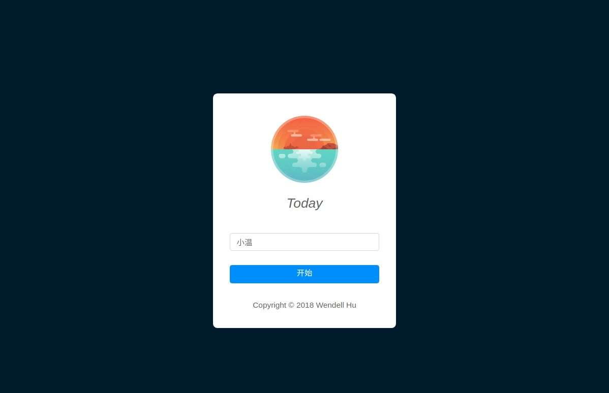

# Today 学习指南



[NG-ZORRO](https://link.zhihu.com/?target=http%3A//ng.ant.design/docs/introduce/zh) 是由阿里巴巴阿里云和计算平台事业部的小伙伴为 Ant Design 开发的 Angular 版本，是一个适用于构建中后台应用的组件库。本项目是 NG-ZORRO 的配套教程。如果你想要了解一下 NG-ZORRO 的使用姿势，或者你是 Angular 初学者，想要通过一个项目来锻炼自己的开发能力，欢迎你来学习一下我们的教程!

## 项目介绍

我们的教程项目要带大家编写一个名为 Today 的待办事项应用，该应用主要包含的几个界面以及各个界面包含的主要功能如下：

* 主界面 main
    * 提供最基本的增加、删除、重命名清单和待办事项的功能
    * 支持改变待办事项的排序方法
    * 提供“建议”帮助用户确定今天（或者说接下来）要做的事情
    * 支持移动待办事项到其他列表
* 待办详情界面 detail
    * 展示和修改待办事项的标题、截止时间、计划时间、详情、是否需要提醒等等
* 总结界面 summary
    * 帮助用户记录他们每一天完成任务的情况，并且通过日历的形式进行展示
* 初始化界面 setup
    * 用户在这个界面输入用户名，然后才能使用 Today
* 设置界面 setting
    * 让用户能够修改用户名

你可以点击[这个链接](https://ng-zorro.github.io/today-ng-steps/setup)预览项目的最终成果。

## 目录和连接

本系列文章共有以下 5 篇：

1. [项目简介，学习在项目中添加 NG-ZORRO，编写最简单的 setup（初始设置）界面](./tutorial/1.md)
2. [编写 main（主）界面左侧的 left-control](./tutorial/2.md)
3. [编写 main 界面右侧的 right-control，实现排序和建议功能](./tutorial/3.md)
4. [编写 detail（待办事项详情）界面，设置路由跳转和动画、路由守卫](./tutorial/4.md)
5. [编写总结界面和设置界面、体验优化、体验发布流程，进一步练习的一些建议](./tutorial/5.md)

我们的代码是按照文章的顺序 commit 的，所以你可以 checkout 各个 commit，在读完一篇的时候比较你的代码和我们的提供的代码。

## 构建指导

这个项目的构建方式和一般的 Angular 没有任何不同！而且我们为你准备好了发布脚本，一行代码就能把你的项目发布在 GitHub Pages 上，但是我们还是推荐你去搞懂 `404.html` 这个文件和我们的脚本都做了什么。

```bash
$ ./publish.sh # 输入我就能发布！
```

## 学习建议

该系列教程面向已经有一定经验的前端开发者，如果你满足以下的几个条件，应该就能比较顺利地完成：

* 你对 TypeScript 有一定的使用经验，至少读过文档
* 你完成了 Angular 官网的入门教程（英雄教程），了解 Angular 项目的基本结构，以及常见 API 和 angular-cli 的使用（我在写文章的时候把这作为大家都知道的背景知识）
* 习惯通过阅读文档和搜索独立解决问题
* 由于面向的是比较有经验的开发者，所以除了设计层面的一些考虑之外，文章基本不会对代码做出解释，而这也是一个锻炼你的代码和文档阅读能力的好机会（希望代码写的没糟糕到你不能明白它们 在做什么）！我们希望你在阅读文中代码，了解其大意的基础上自行完成编码，这比对着文章打字或者复制粘贴能够带来更好的学习效果（如果你在读文章的时候发现有一些代码没有贴出——这并不是我们的疏忽！）。

如果你尚不具备这些基础，请先掌握它们再来，这样的学习效果才最好。

如果你对 Angular 或者是 RxJS 有不明白的地方，除了去看它们的文档之外，[NG-ZORRO 专栏的一篇文章](http://zhuanlan.zhihu.com/p/36385830)也能帮到你的忙。

如果你在写代码的时候遇到了问题，请按下面的顺序尝试解决：

1. 看 console 中的报错
2. 在 Angular 的文档中寻找线索
3. 阅读我们提供的源码，看看哪里有不同
4. Google，Stackoverflow 之
5. 浏览 ng-zorro 的 issue，看是否有人遇到过同样的问题
6. 给我们团队的一位成员发邮件 wendzhue@gmail.com，清晰地陈述你遇到的问题，最好带上详细的截图

## 深度参与

完成了项目之后感到意犹未尽吗？欢迎深度参与这个教程项目。你可以提交 PR 来丰富我们在最后一篇文章中提到的功能，[详情请查看这个 issue](https://github.com/NG-ZORRO/today-ng-steps/issues/2)。你的代码通过 review 之后，将会成为项目的一部分，供更多的人进行更深度的练习。

---

准备好了吗？欢迎开始这段学习旅程，希望你能享受到用 Angular + NG-ZORRO 进行开发的乐趣！
