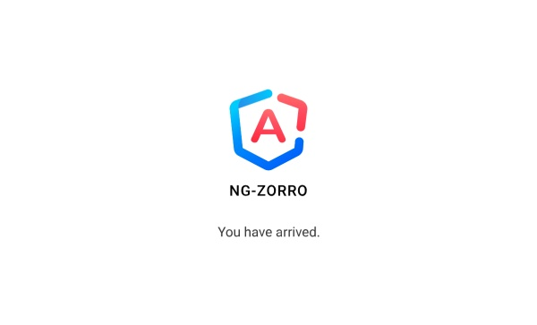
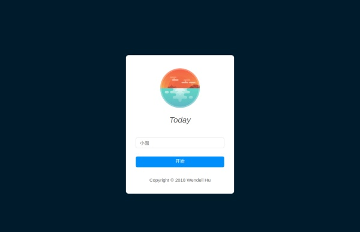

# Angular 实战教程 - 手把手教你构建待办事项应用 Today (Part 1)

## 项目构建

想要了解更多关于项目构建的内容，请阅读 ng-zorro 的文档。

我们先构建一个新项目，然后在这个项目里安装 ng-zorro。

```bash
$ ng new today-ng
$ cd today-ng
$ ng add ng-zorro-antd
```

现在尝试 ng serve，并打开 locahost:4200，你应该可以看到 ng-zorro 的标志了，恭喜你顺利的为你的项目引入了 ng-zorro！



## 划分模块并设置路由

我们的应用分为好几个页面，为了在代码的层面也有对应的划分，并保持好的拓展性和可维护性，我们将每个大页面都划分为一个独立的模块。这篇文章里，我将会向你展示如何做最简单的一个模块 setup。

我们先创建 setup module 和对应的 component：

```bash
ng g m pages/setup
ng g c pages/setup --module pages/setup
```

给项目添加路由。创建 app/app-routing.module.ts 文件，然后编写如下内容：

```ts
import { NgModule } from '@angular/core';
import { RouterModule, Routes } from '@angular/router';
import { SetupComponent } from './pages/setup/setup.component';


const routes: Routes = [
  { path: 'setup', component: SetupComponent },
  { path: '', redirectTo: '/setup', pathMatch: 'full' }
];

@NgModule({
  imports: [ RouterModule.forRoot(routes) ],
  exports: [ RouterModule ]
})
export class AppRoutingModule {}
```

修改 app.module.ts 来引入 setup 以及路由模块：

```ts
// ...

import { AppRoutingModule } from './app-routing.module';
import { SetupModule } from './pages/setup/setup.module';

registerLocaleData(zh);

@NgModule({
  declarations: [
    AppComponent
  ],
  imports: [
    BrowserModule,
    BrowserAnimationsModule,
    FormsModule,
    HttpClientModule,
    NgZorroAntdModule,
    AppRoutingModule,
    SetupModule
  ],
  providers: [ { provide: NZ_I18N, useValue: zh_CN } ],
  bootstrap: [ AppComponent ]
})
export class AppModule { }
```

最后再更新 app.component.html 的内容为 `<router-outlet></router-outlet>`，这样，我们就划分好了第一个模块并处理了部分路由，现在请看浏览器，是不是显示 setup works! 了呢？

## Setup 模块

在我们开始写界面之前，先简单分析一下。显然，我们需要把用户名和初始化标记存入 local storage，也很显然，我们不应该把 localStorage.set 等代码直接下载组件文件中，一是因为其他 module 和 component 肯定也要访问用户名信息，二是这提高了代码的耦合性——如果我们切换了存储机制（比如我们要迁移到 Electron 上，要利用基于数据库和文件的存储），我们需要到处修改——所以我们要在这里引入 local storage service。除此之外，既然多个 module 需要读取同一信息，我们就要对键值 key 做出约定。

想清楚了，我们再开始写代码，在命令行中输入：

```bash
$ ng g s services/local-storage --module app
```

然后在 local-storage.service.ts 中编码：

```ts
import { Injectable } from '@angular/core';

const ls = localStorage;

@Injectable()
export class LocalStorageService {
  constructor() { }

  public get<T>(key: string): any {
    return JSON.parse(ls.getItem(key)) as T;
  }

  public getList<T>(key: string) {
    const before = ls.getItem(key);
    return before ? (JSON.parse(before) as T[]) : [];
  }

  public set(key: string, value: any): void {
    if (!value && value === undefined) { return; }
    const arr = JSON.stringify(value);
    ls.setItem(key, arr);
  }
}
```

在 local-storage.service.ts 同目录下创建 local-storage.namespace.ts 文件（为了简化后面的教程，我这里就把后面会用到的键全告诉你了）：

```ts
export const GLOBAL_NAMESPACE = 'today.';

export const APP_INFO_NAMESPACE = GLOBAL_NAMESPACE + 'appInfo.';
export const INIT_FLAG = APP_INFO_NAMESPACE + 'initFlag';
export const START_USING_DATE = APP_INFO_NAMESPACE + 'startUsingDate';

export const USER_INFO_NAMESPACE = GLOBAL_NAMESPACE + 'userInfo.';
export const USERNAME = USER_INFO_NAMESPACE + 'username';
export const AVATAR_CODE = USER_INFO_NAMESPACE + 'avatarCode';

export const TODO_NAMESPACE = GLOBAL_NAMESPACE + 'todo.';
export const TODOS = TODO_NAMESPACE + 'todos';

export const LIST_NAMESPACE = GLOBAL_NAMESPACE + 'list.';
export const LISTS = LIST_NAMESPACE + 'lists';

export const SUMMARY_NAMESPACE = GLOBAL_NAMESPACE + 'summary.';
export const LAST_SUMMARY_DATE = SUMMARY_NAMESPACE + 'lastSummaryDate';
export const SUMMARIES = SUMMARY_NAMESPACE + 'summaries';
```
> 在用 local storage 进行存储的时候使用命名空间是个最佳实践，命名空间可以是应用名加模块名等形式。

这样就搞定了 service 了，接下来写组件，在 setup.module.html 当中编写界面内容：

```html
<div class="full-screen page-content">
  <div class="wrapper">
    
    <div class="text-wrapper">
      <h1 class="title-text">
        Today
      </h1>
    </div>
    <input nz-input placeholder="请输入你喜欢的用户名" #usernameInput [(ngModel)]="username">
    <button nz-button [nzType]="'primary'" (click)="completeSetup()" [disabled]="!usernameInput.value">
      开始
    </button>
    <div class="copy-right">
      Copyright © 2018 Wendell Hu
    </div>
  </div>
</div>
```

在 setup.component.ts 当中编写界面逻辑：

```ts
import { Component, OnInit } from '@angular/core';
import { LocalStorageService } from '../../services/local-storage/local-storage.service';
import {
  USERNAME,
  INIT_FLAG,
  START_USING_DATE
} from '../../services/local-storage/local-storage.namespace';
import { getTodayTime } from '../../../utils/time';

@Component({
  selector: 'app-setup',
  templateUrl: './setup.component.html',
  styleUrls: [ './setup.component.less' ]
})

export class SetupComponent implements OnInit {
  username: string;

  constructor(
    private store: LocalStorageService
  ) {
  }

  ngOnInit() {
  }

  completeSetup(): void {
    this.store.set(INIT_FLAG, true);
    this.store.set(START_USING_DATE, getTodayTime());
    this.store.set(USERNAME, this.username);
  }
}
```

我们用时间戳来简单的处理时间，项目里有一些简单的方法辅助时间的处理，请参考。

完成（CSS 请自行编写，推荐使用 CSS 的各种预处理器）！你可以在这个界面输入用户名，点击按钮之后，你就能在 local storage 检视面板中看到有三个字段存储了值。

这一篇结束后你应该得到这样的效果：



第一篇教程就到这里，简单回顾一下我们学到的知识点：

* 把 ng-zorro-antd 引入到项目中
* button input 两个组件的使用
* 利用 service 解耦
