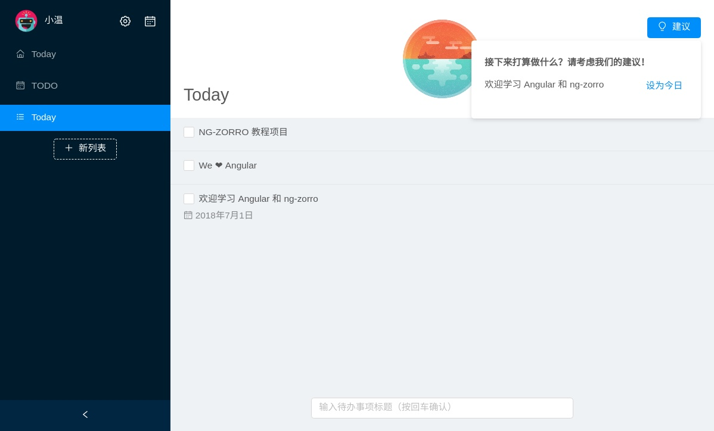
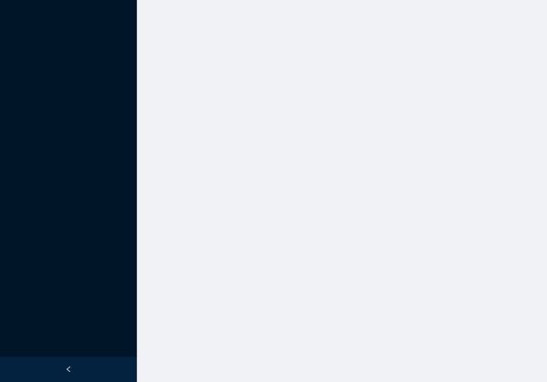
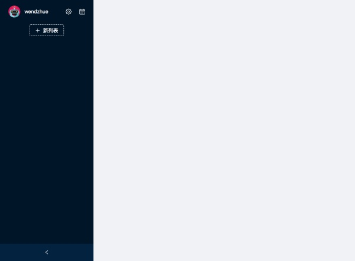
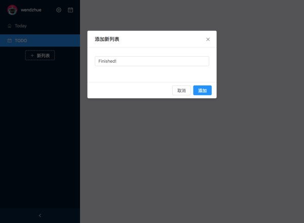

# Angular 实战教程 - 手把手教你构建待办事项应用 Today (Part 2)



从我们上次结束的位置开始，这一篇文章将向你讲解如何编写主界面（main）。

## Main Module

主界面是用户接触最多的界面，用户可以在这里创建列表、待办事项，标记完成等等。

按照之前对项目模块的划分，我们要为主界面创建一个模块和与其对应的组件，在命令行中输入如下命令：

```bash
ng g m pages/main
ng g c pages/main --module pages/main
```

然后在 app-routing.module.ts 添加该组件的路由：

```ts
const routes: Routes = [
  { path: 'setup', component: SetupComponent },
  { path: 'main', redirectTo: '/main', pathMatch: 'full' },
  { path: '', redirectTo: '/main', pathMatch: 'full' }
];
```

按照设计，在我们点击待办事项的时候，会根据待办事项的 ID 来打开一个 URL，弹出的详情页会根据这个 URL 来选择需要展示的待办事项，所以，我们需要在 main 模块里建立子路由。创建 main/main-routing.module.ts 并输入如下内容：

```ts
import { NgModule } from '@angular/core';
import { RouterModule, Routes } from '@angular/router';
import { MainComponent } from './main.component';


const routes: Routes = [
  {
    path: 'main',
    component: MainComponent
  }
];

@NgModule({
  imports: [ RouterModule.forChild(routes) ],
  exports: [ RouterModule ]
})
export class MainRoutingModule { }
```

请自行在 main.module.ts 和 app.module.ts 中声明 imports。

## 界面布局

可以看见主界面分为左右两大块区域，我们使用 NzLayout 来确定布局，在  main.component.ts 中输入：

```html
<nz-layout class="full-screen">
  <nz-sider nzCollapsible
            [(nzCollapsed)]="isCollapsed"
            [nzWidth]="260">
  </nz-sider>
  <nz-content class="container">
  </nz-content>
</nz-layout>
```

在 main.component.ts 中添加 isCollapsed = false，Bang，界面布局就搞定了。



## left-control

我们先来简单梳理一下左边部分的需求（请结合 Demo 来感受）：

* 展示头像、用户名，以及跳转到总结和设置界面的按钮
* 展示列表，包括 Today 和 TODO 两个默认列表，其中 Today 展示的是计划日期为今日的待办事项、TODO 则是默认列表
* 一个新列表按钮，点击以后会弹出一个对话框，输入列表标题即可创建一个新列表
* 支持右键菜单，提供重命名、删除列表两个功能的入口
* 左边部分可收起

了解了需求之后，我们再来编码。

输入如下命令来创建组件：

```bash
ng g c pages/main/left-control
```

我们先把完成页面顶端的部分，输入如下代码：

```html
<!-- left-control.component.html -->
<div class="header-wrapper">
  
  <span class="username-text"
        *ngIf="!isCollapsed">
    {{ username }}
  </span>
  <div class="floating-btn header-btn"
       *ngIf="!isCollapsed">
    <i class="anticon anticon-setting"></i>
  </div>
  <div class="floating-btn header-btn"
       *ngIf="!isCollapsed">
    <i class="anticon anticon-calendar"></i>
  </div>
</div>
<div class="list-wrapper">
  <div class="add-list-btn-wrapper">
    <button nz-button
            nzGhost
            nzType="dashed">
      <i class="anticon anticon-plus"></i>
      <span *ngIf="!isCollapsed">新列表</span>
    </button>
  </div>
</div>
```

```ts
// left-control.component.ts
import { Component, OnInit, Input } from '@angular/core';
import { LocalStorageService } from '../../../services/local-storage/local-storage.service';
import { USERNAME } from '../../../services/local-storage/local-storage.namespace';

@Component({
  selector: 'app-left-control',
  templateUrl: './left-control.component.html',
  styleUrls: [ './left-control.component.less' ]
})
export class LeftControlComponent implements OnInit {
  @Input() isCollapsed: boolean;

  username: string;

  constructor(
    private store: LocalStorageService
  ) { }

  ngOnInit() {
    this.username = this.store.get(USERNAME);
  }
}
```

修改 main.components.html，引入这个新创建的组件。

```html
<nz-layout class="full-screen">
  <nz-sider nzCollapsible
            [(nzCollapsed)]="isCollapsed"
            [nzWidth]="260">
    <app-left-control></app-left-control>
  </nz-sider>
  <nz-content class="container">
  </nz-content>
</nz-layout>
```

你应该得到如下的效果：



接下来，我们来创建列表。列表包含了一组待办事项，可以对列表进行创建、重命名和删除等操作。在写列表组件之前，我们需要先考虑一下这一部分的设计。

## ListService 和 TodoService

我们不应该让 List 组件具有一个保存所有 List 对象的属性，根据 Demo，考虑如下几点：

* 在点击列表的时候，右侧只会显示属于这个列表的待办事项
* 在删除列表的时候，该列表下的待办事项也会被删除
* 右侧的标题区域会显示当前列表的标题

一句话来说，左右两边具有联动关系，所以我们不能让 ListComponent 来管理 List，而应当交给 ListService 来做。同理，Todo 的管理也应当交给 TodoService。这也符合 MVC 设计模式，如果说 HTML 文件是 UI，component.ts 文件是 Controller，我们就需要另外一个文件作为 Model，service 在这里就很合适。

接下来我们就来写 List Todo 这两个实体类，以及相应的 ListService TodoService。

在 src/domain 目录下创建 entities.ts 文件，声明 List 和 Todo 两个类：

```ts
import { generateUUID } from '../utils/uuid';

export class Todo {
  _id: string;
  title: string;
  createdAt: number;
  listUUID: string;
  desc: string;
  completedFlag: boolean;
  completedAt: number;
  dueAt: number;
  planAt: number;
  notifyMe = false;

  constructor(title: string, listUUID?: string) {
    this._id = generateUUID();
    this.title = title;
    this.listUUID = listUUID;
    this.completedFlag = false;
  }
}

export class List {
  _id: string;
  title: string;
  createdAt: number;

  constructor(title: string) {
    this._id = generateUUID();
    this.title = title;
  }
}
```

用命令行创建 service：

```bash
ng g s services/list/list
ng g s services/todo/todo
```

在 list.service.ts 中输入：

```ts
import { Injectable } from '@angular/core';
import { Subject } from 'rxjs';
import { LocalStorageService } from '../local-storage/local-storage.service';
import { List } from '../../../domain/entities';
import { LISTS } from '../local-storage/local-storage.namespace';


type SpecialListUUID = 'today' | 'todo';

@Injectable()
export class ListService {

  private current: List;
  private lists: List[] = [];

  currentUuid: SpecialListUUID | string = 'today';
  currentUuid$ = new Subject<string>();
  current$ = new Subject<List>();
  lists$ = new Subject<List[]>();

  constructor(
    private store: LocalStorageService
  ) { }

  private broadCast(): void {
    this.lists$.next(this.lists);
    this.current$.next(this.current);
    this.currentUuid$.next(this.currentUuid);
  }

  private persist(): void {
    this.store.set(LISTS, this.lists);
  }

  private getByUuid(uuid: string): List {
    return this.lists.find(l => l._id === uuid);
  }

  private update(list: List): void {
    const index = this.lists.findIndex(l => l._id === list._id);
    if (index === -1) {
      this.lists.splice(index, 1, list);
      this.persist();
      this.broadCast();
    }
  }

  getCurrentListUuid(): SpecialListUUID | string {
    return this.currentUuid;
  }

  getAll(): void {
    this.lists = this.store.getList(LISTS);
    this.broadCast();
  }

  setCurrentUuid(uuid: string): void {
    this.currentUuid = uuid;
    this.current = this.lists.find(l => l._id === uuid);
    this.broadCast();
  }

  add(title: string): void {
    const newList = new List(title);
    this.lists.push(newList);
    this.currentUuid = newList._id;
    this.current = newList;

    this.broadCast();
    this.persist();
  }

  rename(listUuid: string, title: string) {
    const list = this.getByUuid(listUuid);
    if (list) {
      list.title = title;
      this.update(list);
    }
  }

  delete(uuid: string): void {
    const i = this.lists.findIndex(l => l._id === uuid);
    if (i !== -1) {
      this.lists.splice(i, 1);
      this.currentUuid = this.lists.length
        ? this.lists[ this.lists.length - 1 ]._id
        : this.currentUuid === 'today'
          ? 'today'
          : 'todo';
      this.broadCast();
      this.persist();
    }
  }
}
```

在 todo.service.ts 中输入：

```ts
import { Injectable } from '@angular/core';
import { Subject } from 'rxjs';
import { LocalStorageService } from '../local-storage/local-storage.service';
import { ListService } from '../list/list.service';
import { floorToMinute, ONE_HOUR, getCurrentTime } from '../../../utils/time';
import { Todo } from '../../../domain/entities';
import { TODOS } from '../local-storage/local-storage.namespace';

@Injectable()
export class TodoService {
  todo$ = new Subject<Todo[]>();

  private todos: Todo[] = [];

  constructor(
    private listService: ListService,
    private store: LocalStorageService
  ) {
    this.todos = this.store.getList(TODOS);
  }

  private broadCast(): void {
    this.todo$.next(this.todos);
  }

  private persist(): void {
    this.store.set(TODOS, this.todos);
  }

  getAll(): void {
    this.todos = this.store.getList(TODOS);
    this.broadCast();
  }

  getRaw(): Todo[] {
    // if (!this.todos.length) { this.todos = this.store.getList(TODOS); }
    return this.todos;
  }

  getByUUID(uuid: string): Todo | null {
    return this.todos.filter((todo: Todo) => todo._id === uuid)[ 0 ] || null;
  }

  setTodoToday(uuid: string): void {
    const todo = this.getByUUID(uuid);
    if (todo && !todo.completedFlag) {
      todo.planAt = floorToMinute(new Date()) + ONE_HOUR;
      this.update(todo);
    }
  }

  toggleTodoComplete(uuid: string): void {
    const todo = this.getByUUID(uuid);
    if (todo) {
      todo.completedFlag = !todo.completedFlag;
      todo.completedAt = todo.completedFlag ? getCurrentTime() : undefined;
      this.persist();
    }
  }

  moveToList(uuid: string, listUUID: string): void {
    const todo = this.getByUUID(uuid);
    if (todo) {
      todo.listUUID = listUUID;
      this.update(todo);
    }
  }

  add(title: string): void {
    const listUUID = this.listService.getCurrentListUuid();
    const newTodo = new Todo(title, listUUID);

    if (listUUID === 'today') {
      newTodo.planAt = floorToMinute(new Date()) + ONE_HOUR;
      newTodo.listUUID = 'todo';
    }

    this.todos.push(newTodo);
    this.persist();
    this.broadCast();
  }

  update(todo: Todo): void {
    const index = this.todos.findIndex(t => t._id === todo._id);
    if (index !== -1) {
      todo.completedAt = todo.completedFlag ? getCurrentTime() : undefined;
      this.todos.splice(index, 1, todo);
      this.persist();
      this.broadCast();
    }
  }

  delete(uuid: string): void {
    const index = this.todos.findIndex(t => t._id === uuid);
    if (index !== -1) {
      this.todos.splice(index, 1);
      this.persist()
      this.broadCast();
    }
  }

  deleteInList(uuid: string): void {
    const toDelete = this.todos.filter(t => t.listUUID === uuid);
    toDelete.forEach(t => this.delete(t._id));
  }
}
```

在实现了这两个 service 之后，我们就可以来写 List 组件了。别忘了要在顶层 module 的 providers 中声明这些 service。

## List 组件

输入如下命令：

```bash
ng g c pages/main/left-control/list
```

然后在 list.component.html 和 list.component.ts 中分别输入如下代码：

```html
<ul nz-menu
    [nzTheme]="'dark'"
    [nzMode]="'inline'"
    [nzInlineCollapsed]="isCollapsed">
  <li nz-menu-item
      [nzSelected]="currentListUuid === 'today'"
      (click)="click('today')">
    <span>
      <i class="anticon anticon-home"></i>
      <span class="nav-text">Today</span>
    </span>
  </li>
  <li nz-menu-item
      (click)="click('todo')"
      [nzSelected]="currentListUuid === 'todo'">
    <span>
      <i class="anticon anticon-calendar"></i>
      <span class="nav-text">TODO</span>
    </span>
  </li>
  <li nz-menu-item
      *ngFor="let list of lists"
      [nzSelected]="currentListUuid === list._id"
      (click)="click(list._id)"
      (contextmenu)="contextMenu($event, contextTemplate, list._id)">
    <span>
      <i class="anticon anticon-bars"></i>
      <span class="nav-text">{{ list.title }}</span>
    </span>
  </li>
</ul>

<ng-template #contextTemplate>
  <ul nz-menu
      nzInDropDown
      nzSelectable
      (nzClick)="close()">
    <li nz-menu-item
        (click)="openRenameListModal()">
      <i class="anticon anticon-edit anticon-right-margin"></i>
      <span>重命名</span>
    </li>
    <li nz-menu-divider></li>
    <li nz-menu-item
        (click)="delete()">
      <i class="anticon anticon-delete anticon-right-margin danger"></i>
      <span class="danger">删除列表</span>
    </li>
  </ul>
</ng-template>

<nz-modal [(nzVisible)]="addListModalVisible"
          [nzTitle]="'添加新列表'"
          [nzClosable]="true"
          [nzWidth]="420"
          [nzOkText]="'添加'"
          [nzCancelText]="'取消'"
          [nzMaskClosable]="true"
          (nzOnCancel)="closeAddListModal()"
          (nzOnOk)="add(listInput.value); listInput.value = '';">
  <form nz-form>
    <nz-form-item>
      <nz-form-control>
        <input nz-input
               #listInput
               name="listTitle"
               placeholder="列表名称"
               (keydown.enter)="add(listInput.value); listInput.value = '';">
      </nz-form-control>
    </nz-form-item>
  </form>
</nz-modal>

<nz-modal [(nzVisible)]="renameListModalVisible"
          [nzTitle]="'重命名列表'"
          [nzClosable]="true"
          [nzWidth]="420"
          [nzOkText]="'重命名'"
          [nzCancelText]="'取消'"
          [nzMaskClosable]="true"
          (nzOnCancel)="closeRenameListModal()"
          (nzOnOk)="rename(listRenameInput.value); listRenameInput.value = '';">
  <form nz-form>
    <nz-form-item>
      <nz-form-control>
        <input nz-input
               #listRenameInput
               placeholder="列表名称"
               name="renameListTitle"
               (keydown.enter)="rename(listRenameInput.value); listRenameInput.value = '';">
      </nz-form-control>
    </nz-form-item>
  </form>
</nz-modal>
```

在代码中可以看到，我们不仅用了 NzMenu 来展示列表，同时还用到了 NzModal 来实现新建列表和修改列表 title 的对话框，和 NzDropdownService 来实现右键菜单。

```ts
import {
  Component,
  OnInit,
  Input,
  TemplateRef,
  OnDestroy,
  ViewChild,
  ElementRef
} from '@angular/core';
import {
  NzDropdownService,
  NzDropdownContextComponent,
  NzModalService
} from 'ng-zorro-antd';
import { Subject } from 'rxjs';
import { takeUntil } from 'rxjs/operators';
import { List } from '../../../../../domain/entities';
import { ListService } from '../../../../services/list/list.service';
import { TodoService } from '../../../../services/todo/todo.service';

@Component({
  selector: 'app-list',
  templateUrl: './list.component.html',
  styleUrls: [ './list.component.css' ]
})
export class ListComponent implements OnInit, OnDestroy {
  @Input() isCollapsed: boolean;
  @ViewChild('listRenameInput') private listRenameInput: ElementRef;
  @ViewChild('listInput') private listInput: ElementRef;

  lists: List[];
  currentListUuid: string;
  contextListUuid: string;
  addListModalVisible = false;
  renameListModalVisible = false;

  private dropdown: NzDropdownContextComponent;
  private destroy$ = new Subject();

  constructor(
    private dropdownService: NzDropdownService,
    private listService: ListService,
    private todoService: TodoService,
    private modal: NzModalService
  ) { }

  ngOnInit() {
    this.listService.lists$
      .pipe(takeUntil(this.destroy$))
      .subscribe(lists => {
        this.lists = lists;
      });

    this.listService.currentUuid$
      .pipe(takeUntil(this.destroy$))
      .subscribe(uuid => {
        this.currentListUuid = uuid;
      });

    this.listService.getAll();
  }

  ngOnDestroy() {
    this.destroy$.next();
  }

  closeAddListModal(): void {
    this.addListModalVisible = false;
  }

  closeRenameListModal(): void {
    this.renameListModalVisible = false;
  }

  openAddListModal(): void {
    this.addListModalVisible = true;
    setTimeout(() => {
      this.listInput.nativeElement.focus();
    });
  }

  openRenameListModal(): void {
    this.renameListModalVisible = true;
    setTimeout(() => {
      const title = this.lists.find(l => l._id === this.contextListUuid).title;
      console.log(title);
      this.listRenameInput.nativeElement.value = title;
      this.listRenameInput.nativeElement.focus();
    });
  }

  contextMenu($event: MouseEvent, template: TemplateRef<void>, uuid: string): void {
    this.dropdown = this.dropdownService.create($event, template);
    this.contextListUuid = uuid;
  }

  click(uuid: string): void {
    this.listService.setCurrentUuid(uuid);
  }

  rename(title: string): void {
    this.listService.rename(this.contextListUuid, title);
    this.closeRenameListModal();
  }

  add(title: string): void {
    this.listService.add(title);
    this.closeAddListModal();
  }

  delete(): void {
    const uuid = this.contextListUuid;
    this.modal.confirm({
      nzTitle: '确认删除列表',
      nzContent: '该操作会导致该列表下的所有待办事项被删除',
      nzOnOk: () =>
        new Promise((res, rej) => {
          this.listService.delete(uuid);
          this.todoService.deleteInList(uuid);
          res();
        }).catch(() => console.error('Delete list failed'))
    });
  }

  close(): void {
    this.dropdown.close();
  }
}
```

你可能会问，既然我们在 ListService 中创建了 lists 数组属性来保存所有的列表对象，而且 ListComponent 也会去访问这个 service 获取列表对象，那为什么不直接把 lists 暴露成 public 的然后让 ListComponent 直接去访问它呢？我们现在通过 rxjs 订阅 lists 发生的变化，并且封装了一系列方法，好像是多此一举的行为。其实这不仅是为了避免发生在意料之外的对数据的改动（你可以确保 lists 不会因为第三方代码而发生出人意料的变化），在之后的文章中你还会看到，如果组件需要一套复杂的逻辑来展示 service 中的数据，那么这种模式会让你清楚的了解数据的流动方式和属性之间的依赖。

我们修改 left-control.component.html 来引入这个组件：

```html
<div class="list-wrapper">
  <app-list [isCollapsed]="isCollapsed"></app-list>
  <div class="add-list-btn-wrapper">
    <button nz-button
            nzGhost
            nzType="dashed">
      <i class="anticon anticon-plus"></i>
      <span *ngIf="!isCollapsed">新列表</span>
    </button>
  </div>
</div>
```

这时候点击 “+新列表” 按钮，会发现没有反应，为什么呢？原来新增列表的模态框是写在 list 组件里的，而按钮是写在 left-control 组件里的，所以我们需要从 left-control 调用子组件的方法，这就需要用到 Angular 的 ViewChild 装饰器。

修改 left-control.component.html，绑定按钮被点击时调用的方法：

```html
<button nz-button nzGhost nzType="dashed" (click)="openAddListModal()">
  <i class="anticon anticon-plus"></i>
  <span *ngIf="!isCollapsed">新列表</span>
</button>
```

修改 left-control.component.ts：

```ts
import { Component, OnInit, Input, ViewChild } from '@angular/core';
import { ListComponent } from './list/list.component';
import { LocalStorageService } from '../../../services/local-storage/local-storage.service';
import { USERNAME } from '../../../services/local-storage/local-storage.namespace';

@Component({
  selector: 'app-left-control',
  templateUrl: './left-control.component.html',
  styleUrls: [ './left-control.component.less' ]
})
export class LeftControlComponent implements OnInit {
  @Input() isCollapsed: boolean;
  @ViewChild(ListComponent) listComponent: ListComponent;

  username: string;

  constructor(
    private store: LocalStorageService
  ) { }

  ngOnInit() {
    this.username = this.store.get(USERNAME);
  }

  openAddListModal(): void {
    // 在 Angular 中调用子组件
    this.listComponent.openAddListModal();
  } 
}
```

再试试看。你可以发现点击按钮后，会弹出一个对话框，输入标题后按回车或点击“添加”，一个新的列表就被创建并选中了——这样我们就完成了主界面左边部分的大部分工作！最后，将 isCollapsed 属性在组件之间进行传递，以便侧边栏收起时能够改变界面的部分外观（请自行完成）。

这一篇结束的时候你的应用应该是这样子的：



第二篇教程就到这里，简单回顾一下我们学到的知识点：

* NzLayout NzModal NzMenu NzDropdown 等组件的使用
* 利用 service 作为 model 来维护信息源

下一篇文章，我们将会编写界面的右边部分。
