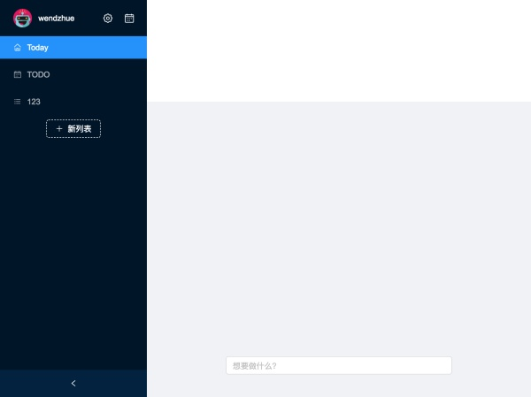
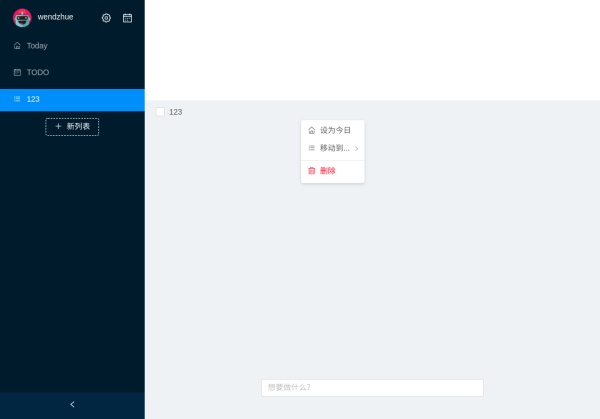
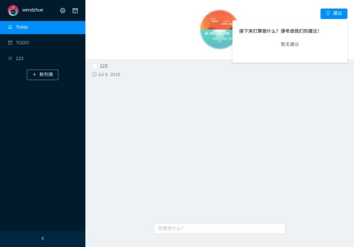

# Angular 实战教程 - 手把手教你构建待办事项应用 Today (Part 3)

在上一篇文章中我们完成了主界面的左边部分，在这篇文章中我们会将右边部分也完成。

## right-control

从 Demo 中可以看到，右边主要分为三个部分，一是上方的 header 区域，展示当前列表名称，建议按钮和排序按钮，二是当前列表下待办事项的显示区域，三是快速添加待办事项的输入框。我们先来生成这些组件：

```bash
ng g c pages/main/right-control
ng g c pages/main/right-control/header
ng g c pages/main/right-control/quick-add
ng g c pages/main/right-control/todo
```

在 right-control.component.html 中先规划好页面结构：

```html
<nz-layout class="right-control">
  <nz-header class="header-wrapper">
  </nz-header>
  <nz-content class="list-wrapper">
  </nz-content>
  <div class="quick-add-wrapper">
  </div>
</nz-layout>
```

接下来我们先写 Todo 组件。

## Todo

在 todo.component.html 中输入如下内容：

```html
<nz-list *ngIf="todos.length > 0"
         [nzDataSource]="todos"
         [nzRenderItem]="item"
         [nzItemLayout]="'horizontal'">
  <ng-template #item
               let-item>
    <nz-list-item class="todo-item"
                  (click)="click(item._id)">
      <nz-list-item-meta [nzTitle]="nzTitle">
        <ng-template #nzTitle>
          <label nz-checkbox
                 (click)="$event.stopPropagation()"
                 [(ngModel)]="item.completedFlag"
                 (ngModelChange)="toggle(item._id)"></label>
          <span [class.strikethrough]="item.completedFlag">{{ item.title }}</span>
        </ng-template>
      </nz-list-item-meta>
    </nz-list-item>
  </ng-template>
</nz-list>
```

在 todo.component.ts 输入如下内容：

```ts
import { Component, OnInit, OnDestroy } from '@angular/core';
import { Router } from '@angular/router';
import { NzDropdownService } from 'ng-zorro-antd';
import { combineLatest, Subject } from 'rxjs';
import { takeUntil } from 'rxjs/operators';
import { Todo, List } from '../../../../../domain/entities';
import { TodoService } from '../../../../services/todo/todo.service';
import { ListService } from '../../../../services/list/list.service';
import { floorToDate, getTodayTime } from '../../../../../utils/time';

@Component({
  selector: 'app-todo',
  templateUrl: './todo.component.html',
  styleUrls: [ './todo.component.less' ]
})
export class TodoComponent implements OnInit, OnDestroy {
  private destory$ = new Subject();

  todos: Todo[] = [];
  lists: List[] = [];
  currentContextTodo: Todo;

  constructor(
    private listService: ListService,
    private todoService: TodoService
  ) { }

  ngOnInit() {
    this.listService.lists$
      .pipe(takeUntil(this.destory$))
      .subscribe(lists => {
        this.lists = lists;
      });

    combineLatest(this.listService.currentUuid$, this.todoService.todo$)
      .pipe(takeUntil(this.destory$))
      .subscribe(sources => {
        this.processTodos(sources[ 0 ], sources[ 1 ]);
      });

    this.todoService.getAll();
    this.listService.getAll();
  }

  ngOnDestroy() {
    this.destory$.next();
  }

  private processTodos(listUUID: string, todos: Todo[]): void {
    const filteredTodos = todos
      .filter(todo => {
        return ((listUUID === 'today' && todo.planAt && floorToDate(todo.planAt) <= getTodayTime())
          || (listUUID === 'todo' && (!todo.listUUID || todo.listUUID === 'todo'))
          || (listUUID === todo.listUUID));
      })
      .map(todo => Object.assign({}, todo) as Todo);

    this.todos = [].concat(filteredTodos);
  }

  add(title: string): void {
    this.todoService.add(title);
  }
}
```

我们在之前一篇文章中曾经讨论过为什么不直接访问 service 的属性，而用一种看起来比较麻烦的订阅机制，这里就展现出原因了：借助 rxjs 的强大威力，我们在当前列表改变的时候，不需要命令式地去修改列表，我们之后会做的排序，同样通过这种机制监听排序依据改变的事件。如果你想要增加更多的功能，良好的可拓展性是很有必要的。

## Quick Add

现在有了 Todo 组件，但还无法显示待办事项清单——因为我们还办法添加待办事项呢！
我们需要 Quick Add 组件，它是个浮动的输入框，用户输入待办事项标题后按下回车，就可以添加一条待办事项。

在 quick-add.component.html 中输入：

```html
<input nz-input
       #addInput
       placeholder="想要做什么？"
       (keydown.enter)="addTodo(addInput.value); addInput.value = ''">
```

在 quick-add.component.ts 中输入：

```ts
import { Component, EventEmitter, OnInit, Output } from '@angular/core';

@Component({
  selector: 'app-quick-add',
  templateUrl: './quick-add.component.html',
  styleUrls: [ './quick-add.component.less' ]
})
export class QuickAddComponent implements OnInit {
  @Output() add = new EventEmitter<string>();

  constructor() { }

  ngOnInit() {
  }

  addTodo(title: string) {
    if (title) { this.add.next(title); }
  }
}
```

然后在 right-control.component.html 中引入这两个组件：

```html
<nz-layout class="right-control">
  <nz-header class="header-wrapper">
  </nz-header>
  <nz-content class="list-wrapper">
    <app-todo></app-todo>
  </nz-content>
  <div class="quick-add-wrapper">
    <app-quick-add></app-quick-add>
  </div>
</nz-layout>
```

预览，效果如下：



可以看到，输入之后回车，并没有实现我们设计的效果，这是因为我们没有触发 Todo 组件中的方法。在 right-control.component.html 中作出如下修改：

```html
<app-quick-add (add)="add($event)"></app-quick-add>
```

然后在 right-control.component.ts 中添加方法：

```ts
import { Component, OnInit, ViewChild } from '@angular/core';
import { TodoComponent } from './todo/todo.component';

@Component({
  selector: 'app-right-control',
  templateUrl: './right-control.component.html',
  styleUrls: [ './right-control.component.less' ]
})
export class RightControlComponent implements OnInit {
  ...

  add(title: string) {
    this.todoList.add(title);
  }
}
```

这时候应用就按照我们的设计工作了！

## 体验提升

但是现在的易用性显然无法令我们满意，让我们来增加功能。

首先，我们要在待办事项设定了截止日期、计划日期和详情的时候，在主界面进行显示。然后，我们要为待办事项添加右键菜单，让用户能够方便地使用移动到别的列表、设置计划日期和删除等功能。

修改  todo.component.html 文件：

```html
<nz-list *ngIf="todos.length > 0"
         [nzDataSource]="todos"
         [nzRenderItem]="item"
         [nzItemLayout]="'horizontal'">
  <ng-template #item
               let-item>
    <nz-list-item class="todo-item"
                  (click)="click(item._id)"
                  (contextmenu)="contextMenu($event, todoContextRef, item._id)">
      <nz-list-item-meta [nzTitle]="nzTitle"
                         [nzDescription]="nzDescription">
        <ng-template #nzTitle>
          <label nz-checkbox
                 (click)="$event.stopPropagation()"
                 [(ngModel)]="item.completedFlag"
                 (ngModelChange)="toggle(item._id)"></label>
          <span [class.strikethrough]="item.completedFlag">{{ item.title }}</span>
        </ng-template>
        <ng-template #nzDescription>
          <span *ngIf="item.dueAt"
                class="todo-desc">
            <i class="anticon anticon-calendar"></i> {{ item.dueAt | date }}</span>
          <span *ngIf="item.planAt"
                class="todo-desc">
            <i class="anticon anticon-clock-circle-o"></i> {{ item.planAt | date }}</span>
          <span *ngIf="item.notifyMe"
                class="todo-desc">
            <i class="anticon anticon-bell"></i>
          </span>
          <span *ngIf="item.desc">
            <i class="anticon anticon-edit"></i>
          </span>
        </ng-template>
      </nz-list-item-meta>
    </nz-list-item>
  </ng-template>
</nz-list>

<ng-template #todoContextRef>
  <ul nz-menu
      nzInDropDown
      (nzClick)="close()">
    <li nz-menu-item
        (click)="setToday()">
      <i class="anticon anticon-home anticon-right-margin"></i>
      <span>设为今日</span>
    </li>
    <li nz-submenu>
      <span title>
        <i class="anticon anticon-bars anticon-right-margin"></i>移动到...</span>
      <ul>
        <li nz-menu-item
            *ngIf="currentContextTodo?.listUUID !== 'todo'"
            (click)="moveToList('todo')">
          默认列表
        </li>
        <li nz-menu-item
            *ngFor="let list of listsExcept(currentContextTodo.listUUID)"
            (click)="moveToList(list._id)">
          {{ list.title }}
        </li>
      </ul>
    </li>
    <li nz-menu-divider></li>
    <li nz-menu-item
        (click)="delete()">
      <i class="anticon anticon-delete anticon-right-margin danger"></i>
      <span class="danger">删除</span>
    </li>
  </ul>
</ng-template>
```

以及 todo.component.ts 文件：

```ts
import { Component, OnInit, OnDestroy, TemplateRef } from '@angular/core';
import { NzDropdownService, NzDropdownContextComponent } from 'ng-zorro-antd';
import { combineLatest, Subject } from 'rxjs';
import { takeUntil } from 'rxjs/operators';
import { Todo, List } from '../../../../../domain/entities';
import { TodoService } from '../../../../services/todo/todo.service';
import { ListService } from '../../../../services/list/list.service';
import { floorToDate, getTodayTime } from '../../../../../utils/time';

@Component({
  selector: 'app-todo',
  templateUrl: './todo.component.html',
  styleUrls: [ './todo.component.less' ]
})
export class TodoComponent implements OnInit, OnDestroy {
  private dropdown: NzDropdownContextComponent;
  private destory$ = new Subject();

  todos: Todo[] = [];
  lists: List[] = [];
  currentContextTodo: Todo;

  constructor(
    private listService: ListService,
    private todoService: TodoService,
    private dropdownService: NzDropdownService
  ) { }

  ngOnInit() {
    this.listService.lists$
      .pipe(takeUntil(this.destory$))
      .subscribe(lists => {
        this.lists = lists;
      });

    combineLatest(this.listService.currentUuid$, this.todoService.todo$)
      .pipe(takeUntil(this.destory$))
      .subscribe(sources => {
        this.processTodos(sources[ 0 ], sources[ 1 ]);
      });

    this.todoService.getAll();
    this.listService.getAll();
  }

  ngOnDestroy() {
    this.destory$.next();
  }

  private processTodos(listUUID: string, todos: Todo[]): void {
    const filteredTodos = todos
      .filter(todo => {
        return ((listUUID === 'today' && todo.planAt && floorToDate(todo.planAt) <= getTodayTime())
          || (listUUID === 'todo' && (!todo.listUUID || todo.listUUID === 'todo'))
          || (listUUID === todo.listUUID));
      })
      .map(todo => Object.assign({}, todo) as Todo);

    this.todos = [].concat(filteredTodos);
  }

  add(title: string): void {
    this.todoService.add(title);
  }

  contextMenu(
    $event: MouseEvent,
    template: TemplateRef<void>,
    uuid: string
  ): void {
    this.dropdown = this.dropdownService.create($event, template);
    this.currentContextTodo = this.todos.find(t => t._id === uuid);
  }

  listsExcept(listUUID: string): List[] {
    return this.lists.filter(l => l._id !== listUUID);
  }

  toggle(uuid: string): void {
    this.todoService.toggleTodoComplete(uuid);
  }

  delete(): void {
    this.todoService.delete(this.currentContextTodo._id);
  }

  setToday(): void {
    this.todoService.setTodoToday(this.currentContextTodo._id);
  }

  moveToList(listUuid: string): void {
    this.todoService.moveToList(this.currentContextTodo._id, listUuid);
  }

  close(): void {
    this.dropdown.close();
  }
}
```



## header

我们现在来做 header 部分，可以看到它主要提供了两个功能：一是点击“建议”按钮后，就可以弹出一个 dropdown 来让用户选择适合今天完成的任务；二是点击“排序”按钮后，就会弹出一个选择框让用户选择待办事项的排序方式。

我们前面已经提到，在实现排序的时候，我们要用订阅发布模式，接下来我们就来实现它。

在 todo.service.ts 中为 TodoService 类增加如下属性和方法：

```ts
@Injectable()
export class TodoService {
  todo$ = new Subject<Todo[]>();
  rank$ = new Subject<RankBy>();

  private todos: Todo[] = [];
  private rank: RankBy = 'title';

  // 还要修改这个方法
  private broadCast(): void {
    this.todo$.next(this.todos);
    this.rank$.next(this.rank);
  }

  toggleRank(r: RankBy): void {
    this.rank = r;
    this.rank$.next(r);
  }
}
```

然后，我们来编写 header.component.html 文件：

```html
<div class="header-container">
  
  <div class="list-title-wrapper">
    {{ listTitle }}
  </div>
  <div class="suggest-btn-wrapper">
    <nz-dropdown [nzTrigger]="'click'" [nzClickHide]="false" [nzPlacement]="'bottomRight'">
      <button nz-dropdown nz-button [nzType]="'primary'">
        <i class="anticon anticon-bulb"></i>建议
      </button>
      <!-- hack nz-zorro! -->
      <div nz-menu class="dropdown-content-wrapper">
      </div>
    </nz-dropdown>
  </div>
  <div class="sort-btn-wrapper">
    <nz-dropdown [nzPlacement]="'bottomRight'">
      <a nz-dropdown>
        排序
        <i class="anticon anticon-down"></i>
      </a>
      <ul nz-menu nzSelectable>
        <li nz-menu-item (click)="switchRankType('title')">
          名称
        </li>
        <li nz-menu-item (click)="switchRankType('planAt')">
          计划时间
        </li>
        <li nz-menu-item (click)="switchRankType('dueAt')">
          截止时间
        </li>
        <li nz-menu-item (click)="switchRankType('completeFlag')">
          完成状态
        </li>
      </ul>
    </nz-dropdown>
  </div>
</div>
```
你可以尝试去掉 `<div nz-menu class="dropdown-content-wrapper">` 中的 nz-menu，会发现下拉动画没有了。官方文档并不会告诉你类似这样的奇技淫巧，而自己去实现这个动画则颇费周折，所以了解一下你所用的库的工作细节还是很有意义的。 

header.component.ts 文件：

```ts
import { Component, OnInit } from '@angular/core';
import { Subscription } from 'rxjs';
import { RankBy } from '../../../../../domain/type';
import { ListService } from '../../../../services/list/list.service';
import { TodoService } from '../../../../services/todo/todo.service';

@Component({
  selector: 'app-header',
  templateUrl: './header.component.html',
  styleUrls: [ './header.component.less' ]
})
export class HeaderComponent implements OnInit {
  private listTitle$: Subscription;

  listTitle = '';

  constructor(
    private listService: ListService,
    private todoService: TodoService
  ) { }

  ngOnInit() {
    this.listTitle$ = this.listService.current$.subscribe(list => {
      this.listTitle = list ? list.title : '';
    });
  }

  switchRankType(e: RankBy): void {
    this.todoService.toggleRank(e);
  }
}
```

不要忘记在 right-control.component.html 中引入这个组件。

尝试在应用里多创建几个待办事项，然后用名称进行排序，会发现没有变化，这是因为我们没有相应地修改 Todo 组件里面的发布订阅机制。不过这个改动也非常简单：

```ts
const rankerGenerator = (type: RankBy = 'title'): any => {
  if (type === 'completeFlag') {
    return (t1: Todo, t2: Todo) => t1.completedFlag && !t2.completedFlag;
  }
  return (t1: Todo, t2: Todo) => t1[ type ] > t2[ type ];
};

export class TodoComponent implements OnInit, OnDestroy {
  // ...

  ngOnInit() {
    this.listService.lists$
      .pipe(takeUntil(this.destory$))
      .subscribe(lists => {
        this.lists = lists;
      });

    combineLatest(this.listService.currentUuid$, this.todoService.todo$, this.todoService.rank$)
      .pipe(takeUntil(this.destory$))
      .subscribe(sources => {
        this.processTodos(sources[ 0 ], sources[ 1 ], sources[ 2 ]);
      });

    this.todoService.getAll();
    this.listService.getAll();
  }

  ngOnDestroy() {
    this.destory$.next();
  }

  private processTodos(listUUID: string, todos: Todo[], rank: RankBy): void {
    const filteredTodos = todos
      .filter(todo => {
        return ((listUUID === 'today' && todo.planAt && floorToDate(todo.planAt) <= getTodayTime())
          || (listUUID === 'todo' && (!todo.listUUID || todo.listUUID === 'todo'))
          || (listUUID === todo.listUUID));
      })
      .map(todo => Object.assign({}, todo) as Todo)
      .sort(rankerGenerator(rank));

    this.todos = [].concat(filteredTodos);
  }

  // ...
}
```

## 建议

Today 的一个亮点功能，就是能够根据待办事项的计划日期和截止日期推荐适合今日完成任务，让我们来实现这个组件。

```bash
ng g c pages/main/right-control/header/suggest
```

然后编写如下代码：

```html
<div class="suggest-container container">
  <span style="font-weight: 700;">
    接下来打算做什么？请考虑我们的建议！
  </span>
  <nz-list class="suggestion-list" [nzDataSource]="suggestedTodo" [nzRenderItem]="item" [nzItemLayout]="'horizontal'">
    <ng-template #item let-item>
      <nz-list-item class="suggestion-item" [nzActions]="[setTodayAction]">
        <nz-list-item-meta [nzTitle]="item.title" [nzDescription]="item.desc">
          <ng-template #nzTitle>
            <a href="https://ng.ant.design">{{item.name.last}}</a>
          </ng-template>
        </nz-list-item-meta>
        <ng-template #setTodayAction>
          <a (click)="setTodoToday(item)">设为今日</a>
        </ng-template>
      </nz-list-item>
    </ng-template>
  </nz-list>
  <div class="no-suggestion" *ngIf="suggestedTodo.length === 0">
    暂无建议
  </div>
</div>
```

```ts
import { Component, OnDestroy, OnInit } from '@angular/core';
import { Subscription } from 'rxjs';
import { Todo } from '../../../../../../domain/entities';
import { TodoService } from '../../../../../services/todo/todo.service';
import { floorToDate, getTodayTime, ONE_DAY } from '../../../../../../utils/time';


@Component({
  selector: 'app-suggest',
  templateUrl: './suggest.component.html',
  styleUrls: [ './suggest.component.less' ]
})
export class SuggestComponent implements OnInit, OnDestroy {
  suggestedTodo: Todo[] = [];

  private todo$: Subscription;

  constructor(
    private todoService: TodoService
  ) { }

  ngOnInit() {
    this.todo$ = this.todoService.todo$.subscribe(todos => {
      const filtered = todos.filter(t => {
        if (t.planAt && floorToDate(t.planAt) <= getTodayTime()) { return false; }
        if (t.dueAt && t.dueAt - getTodayTime() <= ONE_DAY * 2) { return true; }
        return false;
      });
      this.suggestedTodo = [].concat(filtered);
    });

    this.todoService.getAll();
  }

  ngOnDestroy() {
    this.todo$.unsubscribe();
  }

  setTodoToday(todo: Todo): void { this.todoService.setTodoToday(todo._id); }
}
```

在 header.component.html 中引入这个组件，我们的主界面就大功告成了（暂时如此）！



等等，好像有个很严重的问题！我们在判断哪些待办事项能进入推荐的时候，用了两条逻辑，一是事件的计划日期在今天之前，二是事项的截止日期在两天之内，而现在我们因为没有办法设置待办事项详情，所以似乎没有办法能够手工测试它（真的没有办法吗，其实你可以去直接改 local storage）。我们会在下一篇文章中解决这个问题。

第三篇教程就到这里，简单回顾一下我们学到的知识点：

* NzList 组件的使用，用 nz-menu“愚弄”ng-zorro
* 进一步了解发布/订阅模式的好处
