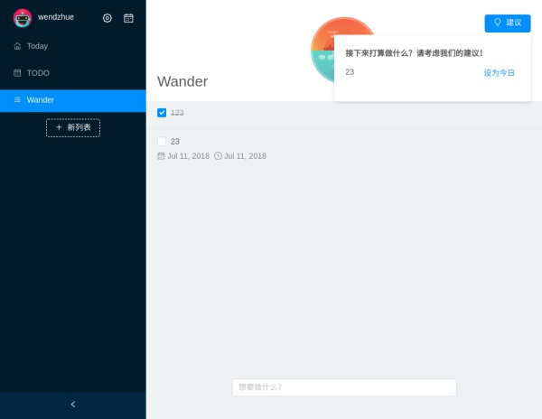

# Angular 实战教程 - 手把手教你构建待办事项应用 Today (Part 4)


## 子路由

如果你对子路由的写法不甚理解，强烈建议去阅读 Angular 关于路由的文档。在 Angular 中设置子路由有很多种方法。

接下来我们实现待办事项详情。首先创建该组件：

```bash
ng g c pages/main/detail 
```

然后更新我们的路由，修改 main-routing.module.ts 文件：

```ts
const routes: Routes = [
  {
    path: 'main',
    component: MainComponent,
    children: [
      {
        path: ':id',
        component: DetailComponent,
        pathMatch: 'full'
      }
    ]
  }
];
```

然后我们在 main.component.html 中设置路由出口：

```html
<nz-layout class="full-screen">
  <nz-sider nzCollapsible [(nzCollapsed)]="isCollapsed" [nzWidth]="260">
    <app-left-control [isCollapsed]="isCollapsed"></app-left-control>
  </nz-sider>
  <nz-content class="container">
    <app-right-control></app-right-control>
  </nz-content>
</nz-layout>
<router-outlet></router-outlet>
```
然后，我们在 Todo 组件当中绑定 click 事件，当待办事项被点击是就跳转到相应的路由结构：/main/:id，给 Todo 组件增加方法： 

```ts
click(uuid: string): void {
  this.router.navigateByUrl(`/main/${uuid}`);
}
```

此时点击组件，可以看到路由已经跳转了，而且检查 Inspector 的确可以找到 detail works 的字样，说明我们的路由添加成功了，接下来我们来完成这个组件。

## Detail

在 demo 中可以看到，该组件分为两个部分：一个是面板，这里可以阅读和修改待办事项的详细信息，一个是底部的模态，点击后可以收起该组件。在 detail.component.html 中输入代码：

```html
<div class="mask" (click)="goBack()">
  <div class="container" (click)="$event.stopPropagation()">
    <div style="text-align: right;">
      <button nz-button nzType="primary" nzSize="large" nzShape="circle" (click)="confirm()" style="margin-right: 10px;">
        <i class="anticon anticon-check"></i>
      </button>
      <button nz-button nz-popconfirm nzPlacement="bottomRight" nzTitle="你真的要删除这条待办事项吗？" (nzOnConfirm)="delete()" nzType="danger"
        nzSize="large" nzShape="circle">
        <i class="anticon anticon-delete"></i>
      </button>
    </div>
    <label nz-checkbox (click)="$event.stopPropagation()" [(ngModel)]="currentTodo.completedFlag"></label>
    <span>标记完成</span>
    <nz-divider nzText="标题" nzOrientation="left"></nz-divider>
    <div class="input-container">
      <input nz-input [(ngModel)]="currentTodo.title" placeholder="待办事项" [disabled]="!!currentTodo.completedFlag" id="title" name="title">
    </div>
    <nz-divider nzText="日期与提醒" nzOrientation="left"></nz-divider>
    <div class="due-date-container input-container">
      <span class="prefix">截止日期</span>
      <nz-date-picker [(ngModel)]="dueDate" [disabled]="!!currentTodo.completedFlag" [nzDisabledDate]="dueDisabledDate" (ngModelChange)="handleDueDateChange($event)">
      </nz-date-picker>
    </div>
    <div class="plan-date-container input-container">
      <span class="prefix">计划日期</span>
      <nz-date-picker nzShowTime [(ngModel)]="planDate" [disabled]="!!currentTodo.completedFlag" [nzDisabledDate]="planDisabledDate"
        (ngModelChange)="handlePlanDateChange($event)">
      </nz-date-picker>
    </div>
    <div class="input-container">
      <span class="prefix">计划提醒</span>
      <nz-switch [(ngModel)]="currentTodo.notifyMe" [nzControl]="true" [nzDisabled]="!!currentTodo.completedFlag" (click)="clickSwitch()"></nz-switch>
    </div>
    <nz-divider nzText="更多" nzOrientation="left"></nz-divider>
    <div class="input-container">
      <textarea nz-input="" row="8" placeholder="待办详情" [disabled]="!!currentTodo.completedFlag" [(ngModel)]="currentTodo.desc"></textarea>
    </div>
  </div>
</div>
```

在 detail.component.ts 中输入如下代码：

```ts
import {
  Component,
  EventEmitter,
  OnInit,
  Output
} from '@angular/core';
import { ActivatedRoute, ParamMap, Router } from '@angular/router';
import { first } from 'rxjs/operators';
import { NzMessageService } from 'ng-zorro-antd';

import { TodoService } from '../../../services/todo/todo.service';
import { Todo } from '../../../../domain/entities';
import { lessThanADay, floorToDate, getCurrentTime, getTodayTime, floorToMinute } from '../../../../utils/time';

@Component({
  selector: 'app-detail',
  templateUrl: './detail.component.html',
  styleUrls: [ './detail.component.less' ]
})
export class DetailComponent implements OnInit {
  @Output() changedTodo = new EventEmitter();

  private trueSource: Todo;
  currentTodo: Todo;
  dueDate: Date;
  planDate: Date;

  constructor(
    private route: ActivatedRoute,
    private router: Router,
    private todoService: TodoService,
    private message: NzMessageService
  ) { }

  ngOnInit() {
    this.route.paramMap.pipe(first()).subscribe((paramsMap: ParamMap) => {
      const id = paramsMap.get('id');
      const todo = this.todoService.getByUUID(id);
      this.trueSource = todo;
      this.currentTodo = Object.assign({}, todo) as Todo;
      if (todo.dueAt) {
        this.dueDate = new Date(todo.dueAt);
      }
      if (todo.planAt) {
        this.planDate = new Date(todo.planAt);
      }
    });
  }

  goBack(): void {
    this.router.navigateByUrl('main');
  }

  handlePlanDateChange(date: Date): void {
    const t = date ? date.getTime() : undefined;
    if (!t) {
      this.currentTodo.notifyMe = false;
    }
    this.currentTodo.planAt = t;
    this.checkDate();
  }

  handleDueDateChange(date: Date): void {
    const dueAt = date ? date.getTime() : undefined;
    this.currentTodo.dueAt = dueAt;
    if (dueAt && lessThanADay(dueAt)) {
      this.message.warning('项目将会在 24 小时内到期', {
        nzDuration: 6000
      });
    }
    this.checkDate();
  }

  private checkDate(): void {
    const { dueAt, planAt } = this.currentTodo;
    if (dueAt && planAt && floorToDate(planAt) > dueAt) {
      this.message.warning('你确定要在到期之后才开始做这个项目吗？', {
        nzDuration: 6000
      });
    }
  }

  dueDisabledDate = (d: Date): boolean => floorToDate(d) < getTodayTime();
  planDisabledDate = (d: Date): boolean => floorToMinute(d) < getCurrentTime();

  clickSwitch(): void {
    if (this.currentTodo.completedFlag) { return; }
    if (!this.currentTodo.planAt) {
      this.message.warning('尚未设置计划日期');
      return;
    }
    this.currentTodo.notifyMe = !this.currentTodo.notifyMe;
  }

  confirm(): void {
    this.todoService.update(this.currentTodo);
    this.goBack();
  }

  delete(): void {
    this.todoService.delete(this.currentTodo._id);
    this.goBack();
  }
}

```

有以下这些要点：

* 从路由获取待办事项的 ID，并从 TodoService 中直接拿到待办事项，这里没有用发布订阅机制，因为详情界面仅需要在每次打开的时候加载待办事项对象就可以了
* 使用了 Object.assign 这个 API 复制了一下待办事项，避免模板和源数据对象直接绑定，避免不经意的修改
* 使用了 NzSwitch NzDivider NzDatepicker NzMessage 等组件

这时候运行你的应用，可以看到它工作了！但是这样的效果太生硬了，我们应该给增加一个进入和退出的动画。

## 路由动画

同样希望你已经知道如何在 Angular 当中创建动画了，如果不知道请先阅读文档。

创建 detail.animation.ts 文件：

```ts
import {
  trigger,
  style,
  animate,
  transition,
  query,
  group
} from '@angular/animations';


export const detailTransition = trigger('detailTransition', [
  transition(
    ':enter',
    group([
      query('div.mask', [ style({ opacity: 0 }), animate('400ms linear') ]),
      query('div.container', [
        style({ transform: 'translate3d(100%, 0, 0)' }),
        animate('400ms ease')
      ])
    ])
  ),
  transition(
    ':leave',
    group([
      query('div.mask', animate('400ms linear', style({ opacity: 0 }))),
      query(
        'div.container',
        animate('400ms ease', style({ transform: 'translate3d(100%, 0, 0)' }))
      )
    ])
  )
]);
```

然后，我们将这些动画绑定在组件上，修改 detail.component.ts 文件：

```ts
@HostBinding('@detailTransition') state = 'activated';
```

再运行应用，体验就比较好了，试一试！

~~虽然我们现在还不能用，但是 ng-zorro 的 PR 中已经有了 Drawer 这个组件，或许它发布之后，你可以用它来修改这部分代码。~~ 现在这个组件已经发布了，你可以自行尝试！

我们现在来验证一下我们上一篇文章写的建议组件能不能正常工作。选择一个待办事项，并设置它的截止日期为两天以内的某个时间，然后点击“建议”，它的确建议我们做这件事情！



## 更多的路由动画和路由守卫

我们实现了一个路由跳转和动画，不妨就在这篇文章里处理一下之前遗留的路由问题。我们现在还没有实现从 setup 到 main 的路由跳转（包括动画），还有一个更重要的问题，我们没有对用户能看到那些界面作出限制，显然，已经输入用户名的用户不能访问 setup 界面，还没有输入用户名的用户不能访问其他界面。Angular 对于这类常见的需求提供了称为路由守卫的解决方案，我们来实现它。路由跳转和动画前面已经演示了一个，请自行完成 setup 到 main 的跳转（还有后面文章中实现的界面的路由跳转）。

```bash
ng g s services/init-guard/init-guard
```

然后输入如下代码：

```ts
import { Injectable } from '@angular/core';
import { ActivatedRouteSnapshot, CanActivate, Router, RouterStateSnapshot } from '@angular/router';
import { LocalStorageService } from '../local-storage/local-storage.service';
import { INIT_FLAG } from '../local-storage/local-storage.namespace';


@Injectable()
export class InitGuardService implements CanActivate {
  constructor(
    private store: LocalStorageService,
    private router: Router,
  ) { }

  canActivate(route: ActivatedRouteSnapshot, state: RouterStateSnapshot): boolean {
    const init = !!this.store.get(INIT_FLAG);

    if (state.url.includes('setup') && init) {
      this.router.navigateByUrl('/main');
      return false;
    }
    if (!state.url.includes('setup') && !init) {
      this.router.navigateByUrl('/setup');
      return false;
    }

    return true;
  }
}
```

然后我们要修改 app-routing.module.ts 路由文件来应用这些保护策略：

```ts
const routes: Routes = [
  { path: 'setup', component: SetupComponent, canActivate: [ InitGuardService ] },
  { path: 'main', redirectTo: '/main', pathMatch: 'full' },
  { path: '', redirectTo: '/setup', pathMatch: 'full' }
];
```

以及 main-routing.module.ts 文件：

```ts
const routes: Routes = [
  {
    path: 'main',
    component: MainComponent,
    canActivate: [ InitGuardService ],
    children: [
      {
        path: ':id',
        component: DetailComponent,
        pathMatch: 'full'
      }
    ]
  }
];
```

现在修改 URL 尝试访问 setup 界面，会发现被重定向到 main 界面了。如果你去 local storage 里删除了用户名信息，会发现无法访问 main 界面。

第四篇教程就到这里，简单回顾一下我们学到的知识点：

* NzSwitchNzDividerNzDatepicker 等组件的使用
* Angular 的路由跳转、路由守卫和动画
