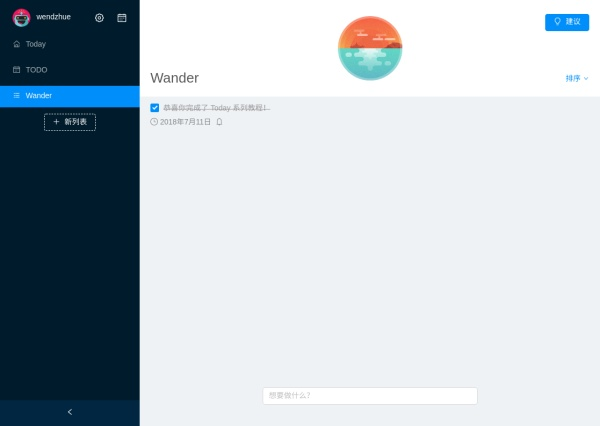

# Angular 实战教程 - 手把手教你构建待办事项应用 Today (Part 5)

## Summary

对于一个待办清单应用来说，如果能够记录用户完成待办事项的情况并形成反馈，用户就能够比较准确地评估自己的工作效率进而做出改变，这显然是很有价值的——接下来我们就来做这个功能。

首先，我们要定义一个 Summary 类记录待办事项的完成情况，它以日期为单位。

在 entities.ts 文件中定义它：

```ts
export class Summary {
  _id: string;
  date: number;
  completedTodos: string[];
  cCount = 0;
  uncompletedTodos: string[];
  uCount = 0;

  constructor(date: number, cItems: string[], uItems: string[]) {
    this.date = date;
    this.completedTodos = cItems;
    this.uncompletedTodos = uItems;
    this.cCount = this.completedTodos.length;
    this.uCount = this.uncompletedTodos.length;
  }
}
```

我们还需要一个 service 来管理这些 Summary 对象，作为模型，这个 service 还要实现生成这些对象的算法（逻辑应该和展示分开）。由于这个 service 只会在 Summary 模块内被用到，所以我们不需要在 app.module.ts 的 providers 中声明它，而应当在 summary.module.ts 中声明，相应的，这个文件的目录也最好放在 summary 下，方便就近维护。当然，把它和其他 service 放在同一目录下，然后在全局声明，也不是一个坏的方法。但是当你的项目比较大的时候，你可能会偏好前一种。**虽然这和 Angular provider 的作用域没有关系。**

新建一个模块：

```bash
ng g m pages/summary
ng g c pages/summary
ng g s pages/summary/summary
```

在 summary.service.ts 中输入如下代码：

```ts
import { Injectable } from '@angular/core';
import { Summary, Todo } from '../../../domain/entities';
import { getTodayTime, floorToDate, ONE_DAY } from '../../../utils/time';
import { LocalStorageService } from '../../services/local-storage/local-storage.service';
import { TodoService } from '../../services/todo/todo.service';
import { LAST_SUMMARY_DATE, START_USING_DATE, SUMMARIES } from '../../services/local-storage/local-storage.namespace';

@Injectable()
export class SummaryService {
  summaries: Summary[] = [];

  constructor(
    private store: LocalStorageService,
    private todoService: TodoService
  ) { }

  doSummary(): void {
    const todayDate = getTodayTime();
    let lastDate = this.store.get(LAST_SUMMARY_DATE) || floorToDate(this.store.get(START_USING_DATE));

    if (lastDate === todayDate) {
      return;
    }

    const todos = this.todoService.getRaw();
    const todosToAna: Todo[] = [];
    const summaries: Summary[] = [];
    const dates: number[] = [];

    todos.forEach((todo) => {
      if (todo.planAt) {
        const date = floorToDate(todo.planAt);
        if (date < todayDate) { todosToAna.push(todo); }
      }
    });

    while (lastDate < todayDate) {
      dates.push(lastDate);
      lastDate += ONE_DAY;
    }

    dates.forEach(date => {
      const completedItems: string[] = [];
      const uncompletedItems: string[] = [];

      todosToAna.forEach(todo => {
        const planAt = floorToDate(todo.planAt);
        if (planAt <= date) {
          if (todo.completedFlag && floorToDate(todo.completedAt) === date) {
            completedItems.push(todo.title);
          } else if (
            todo.completedFlag &&
            floorToDate(todo.completedAt) < date
          ) { /* do nothing */ } else {
            uncompletedItems.push(todo.title);
          }
        }
      });

      summaries.push(new Summary(date, completedItems, uncompletedItems));
    });

    this.store.set(LAST_SUMMARY_DATE, lastDate);
    this.addSummaries(summaries);
  }

  public summaryForDate(date: number): Summary {
    if (!this.summaries.length) { this.summaries = this.loadSummaries(); }
    return this.summaries.find(s => s.date === date);
  }

  private loadSummaries(): Summary[] {
    return this.store.getList<Summary>(SUMMARIES);
  }

  private addSummaries(summaries: Summary[]): void {
    const oldSummaries = this.loadSummaries();
    const newSummaries = oldSummaries.concat(summaries);
    this.store.set(SUMMARIES, newSummaries);
  }
}
```

简单地解释一下 doSummary 这个方法，即生成 Summary 对象的方法。首先找到计划日期在今天之前的待办事项。接着获取上一次做出记录的日期（如果没有记录就是用户开始使用这个应用的日期），然后为上次记录日期和当前日期之间的每一天生成一个时间戳。对于每一天，我们创建一个 Summary 对象，并遍历待办事项，根据它们的完成状态、完成日期和计划日期，来确定 Summary 对象的属性。最后，我们将新生成的 Summary 对象存储起来。

在 summary.component.html 中输入如下代码：

```html
<nz-layout class="full-screen">
  <nz-sider [nzWidth]="260">
    <div class="profile-container">
      <div class="back-btn floating-btn" (click)="goBack()">
        <span class="anticon anticon-left"></span>
      </div>
      
      <div class="username">
        {{ username }}
      </div>
      <div class="date-count">
        已经使用 Today {{ dateCount }} 天
      </div>
    </div>
  </nz-sider>
  <nz-content>
    <nz-calendar>
      <ul *nzDateCell="let date" class="todo-list">
        <div *ngIf="requestForDate(date) as summary" (click)="showSummaryDetail(summary)">
          <li *ngFor="let item of summary.completedTodos">
            <nz-badge [nzStatus]="'success'" [nzText]="item"></nz-badge>
          </li>
          <li *ngFor="let item of summary.uncompletedTodos">
            <nz-badge [nzStatus]="'error'" [nzText]="item"></nz-badge>
          </li>
        </div>
      </ul>
    </nz-calendar>
  </nz-content>
</nz-layout>
```

在 summary.component.ts 中输入如下代码：

```ts
import { Component, HostBinding, OnInit } from '@angular/core';
import { Router } from '@angular/router';
import { NzNotificationService } from 'ng-zorro-antd';
import { SummaryService } from './summary.service';
import { pageSwitchTransition } from './summary.animation';
import { LocalStorageService } from '../../services/local-storage/local-storage.service';
import {
  START_USING_DATE,
  USERNAME
} from '../../services/local-storage/local-storage.namespace';
import { getTodayTime, ONE_DAY } from '../../../utils/time';
import { Summary } from '../../../domain/entities';

@Component({
  selector: 'app-summary',
  templateUrl: './summary.component.html',
  styleUrls: [ './summary.component.less' ],
  animations: [ pageSwitchTransition ]
})
export class SummaryComponent implements OnInit {
  username = this.store.get(USERNAME) || 'username';
  dateCount = Math.floor((getTodayTime() - this.store.get(START_USING_DATE)) / ONE_DAY + 1);

  @HostBinding('@pageSwitchTransition') private state = 'activated';

  constructor(
    private summaryService: SummaryService,
    private store: LocalStorageService,
    private router: Router,
    private noti: NzNotificationService
  ) { }

  ngOnInit() {
    this.summaryService.doSummary();
  }

  requestForDate(date: Date): Summary | null {
    return this.summaryService.summaryForDate(date.getTime());
  }

  showSummaryDetail(summary: Summary): void {
    if (!summary) { return; }

    const { cCount, uCount } = summary;
    if (uCount) {
      this.noti.error('有未完成的项目', `你完成了全部任务的 ${cCount / (cCount + uCount)}%`);
    } else if (cCount) {
      this.noti.success('完成了这一天的全部任务', '干得漂亮');
    }
  }

  goBack(): void {
    this.router.navigateByUrl('/main');
  }
}
```

路由跳转动画请自行完成，我们之前已经演示过一些动画的编码。你还会发现，很多动画是重复的，如何实现这些代码的复用呢？交给你去思考。

我们在这里使用了 NzCalendar 组件，并通过自定义日期单元格中的内容来展示某日用户完成和未完成的待办事项，我们还是用了 NzNotification 组件，来展示完成的待办事项的比例。请阅读文档来了解这两个组件的 API。

然后，我们需要在全局路由中新建一个路由项：

```ts
{ path: 'summary', redirectTo: '/summary', pathMatch: 'full' },
```

我们在各个子模块中都使用相同的路由结构（即让子模块去管理自己底下的路由），请自行完成子路由的构建和路由保护——这在上一篇文章里也讲过了哦！


现在 Summary 组件还不能提供演示，不过你可以通过修改 local storage 伪造数据来生成演示，请在读懂了算法之后试一试！你的效果应该和我在第一篇文章中给出的预览一样：


## Setting

这是我们最后一个模块了，它的功能非常简单，现在仅仅支持修改用户名！我相信你现在能够独立完成它，试试看吧！

这个界面相当简单，请自行完成，但也要考虑一些特殊情况哦。


## 设置导航

最后，我们在 left-control 组件中增加到 summary 和 setting 的导航，修改 left-control.component.html：

```html
  <div (click)="goSetting()" class="floating-btn header-btn" *ngIf="!isCollapsed">
    <i class="anticon anticon-setting"></i>
  </div>
  <div (click)="goSummary()" class="floating-btn header-btn" *ngIf="!isCollapsed">
    <i class="anticon anticon-calendar"></i>
  </div>
```html

和 left-control.component.ts：

```ts
  goSetting() {
    this.router.navigateByUrl('/setting');
  }

  goSummary() {
    this.router.navigateByUrl('/summary');
  }
```

当然啦，你可以直接用 routerLink。

完成！现在我们已经十分接近 demo 的效果了！

## 体验优化

让我们来做最后的扫尾工作，优化用户体验。

现在的输入框被固定在页面的下部，并不是特别醒目。我们来实现这样一个效果：当当前列表没有待办事项的时候，输入框居中展示；当前列表有待办事项的时候，再移动到底部（查看 Demo 会让你有直观的感受）。对于这个简单的动画，我们不需要使用 Angular 的 animation API，使用动态 CSS 类就可以了，修改 right-control.component.html：

```html
  <div class="quick-add-wrapper" [class.center]="todoList.todos.length === 0">
    <app-quick-add (add)="add($event)"></app-quick-add>
  </div>
```

对应的 less（整个系列唯一贴样式代码的地方！）：

```less
  .quick-add-wrapper {
    position: absolute;
    left: 50%;
    bottom: 40px;
    width: 400px;
    transform: translate3d(-50%, 0, 0);
    transition: 0.2s ease all;

    &.center {
      bottom: 50%;
    }
  }
```

然后将 right-control.component.ts 中的 todoList 该为 public，OK！
还有一个问题，就是待办事项的日期格式化并不是中文，在 app.module.ts 中配置 providers：

```ts
{ provide: LOCALE_ID, useValue: 'zh-Hans' },
```

OK！

做到这里你已经完成了系列教程，恭喜恭喜！



## 发布

现在应用的完成度已经足够拿给小伙伴们看啦，我们来把它部署到 GitHub Pages 上吧。关于部署，请先阅读 Angular 的文档，Angular 的部署要特别注意路径问题。

首先，改变 index.html：

```html
<base href="./">

<script type="text/javascript">
    // Single Page Apps for GitHub Pages
    // https://github.com/rafrex/spa-github-pages
    // Copyright (c) 2016 Rafael Pedicini, licensed under the MIT License
    // ----------------------------------------------------------------------
    // This script checks to see if a redirect is present in the query string
    // and converts it back into the correct url and adds it to the
    // browser's history using window.history.replaceState(...),
    // which won't cause the browser to attempt to load the new url.
    // When the single page app is loaded further down in this file,
    // the correct url will be waiting in the browser's history for
    // the single page app to route accordingly.
    (function (l) {
      if (l.search) {
        var q = {};
        l.search.slice(1).split('&').forEach(function (v) {
          var a = v.split('=');
          q[ a[ 0 ] ] = a.slice(1).join('=').replace(/~and~/g, '&');
        });
        if (q.p !== undefined) {
          window.history.replaceState(null, null,
            l.pathname.slice(0, -1) + (q.p || '') +
            (q.q ? ('?' + q.q) : '') +
            l.hash
          );
        }
      }
    }(window.location))
</script>
```

然后，在项目根目录创建 404.html 文件，复制以下内容：

```html
<!DOCTYPE html>
<html>

<head>
  <meta charset="utf-8">
  <title>Single Page Apps for GitHub Pages</title>
  <script type="text/javascript">
    // Single Page Apps for GitHub Pages
    // https://github.com/rafrex/spa-github-pages
    // Copyright (c) 2016 Rafael Pedicini, licensed under the MIT License
    // ----------------------------------------------------------------------
    // This script takes the current url and converts the path and query
    // string into just a query string, and then redirects the browser
    // to the new url with only a query string and hash fragment,
    // e.g. http://www.foo.tld/one/two?a=b&c=d#qwe, becomes
    // http://www.foo.tld/?p=/one/two&q=a=b~and~c=d#qwe
    // Note: this 404.html file must be at least 512 bytes for it to work
    // with Internet Explorer (it is currently > 512 bytes)
    // If you're creating a Project Pages site and NOT using a custom domain,
    // then set segmentCount to 1 (enterprise users may need to set it to > 1).
    // This way the code will only replace the route part of the path, and not
    // the real directory in which the app resides, for example:
    // https://username.github.io/repo-name/one/two?a=b&c=d#qwe becomes
    // https://username.github.io/repo-name/?p=/one/two&q=a=b~and~c=d#qwe
    // Otherwise, leave segmentCount as 0.
    var segmentCount = 1;
    var l = window.location;
    l.replace(
      l.protocol + '//' + l.hostname + (l.port ? ':' + l.port : '') +
      l.pathname.split('/').slice(0, 1 + segmentCount).join('/') + '/?p=/' +
      l.pathname.slice(1).split('/').slice(segmentCount).join('/').replace(/&/g, '~and~') +
      (l.search ? '&q=' + l.search.slice(1).replace(/&/g, '~and~') : '') +
      l.hash
    );
  </script>
</head>

<body>
</body>

</html>
```

然后，创建一个 publish.sh 文件，输入如下代码：

```bash
ng build --prod;
cp ./404.html ./dist/today-ng/404.html;
git add dist --force;
git commit -m "demo: build demo";
git subtree push --prefix dist/today-ng origin gh-pages;
```

确保你已经在 GitHub 上建立了这个项目，并且设置了正确的 origin 远程仓库位置。
然后运行这个脚本吧！等脚本运行完成，访问 `https://[你的 GitHub ID].github.io/[你的仓库名]`，就能使用这个在线版本的应用了！我提供的 demo 也是这样发布的。你可能会奇怪这个 404.html 和 我们在 index.html 中添加的奇怪的脚本是拿来干什么使的，简单来说是让服务器能够知道从哪个位置切分路径，之前的路径交给服务器定位 Angular 应用的入口文件，之后的路径交给 Angular 当做应用内路由，文档和 404.html 中的链接会告诉你详情，这里就不赘述了。

第五篇教程就到这里，简单回顾一下我们学到的知识点：

* NzCalendar NzNotification 等组件的使用
* Angular 应用的部署

## 结束

至此，我们整个教程系列的结束了。当然 Angular 提供的很多功能和 API 我们还没有 cover（比如很重要的 HttpClient），NG-ZORRO 的很多组件我们也没用过，所以如果你想继续通过这个项目锻炼自己，可以考虑以下需求：

* 头像设置
* 以月为单位总结用户的待办事项完成情况
* 标记待办事项完成时的提示音
* 隐藏已经完成的项目
* 标签
* 显示用户所在位置的天气（甚至根据天气推荐适合今日做的待办事项，或者不推荐做的！）
* 可变主题（根据当前的时间选择对应的主题是个不错的主意）
* 通知（我们做了开关，但是还没有实现这个功能）
* 部分功能在 setting 界面的可配置

感谢阅读！希望这个项目能够带你入门 Angular 和 NG-ZORRO 的使用，欢迎留下你对本系列教程的意见和建议，也希望你能持续关注 Angular 和 NG-ZORRO 项目。

Happy coding!
